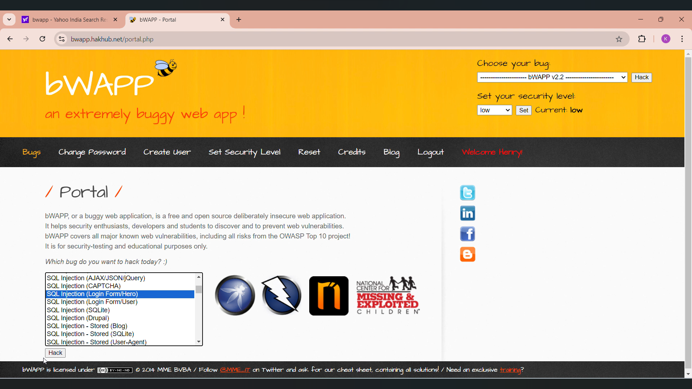
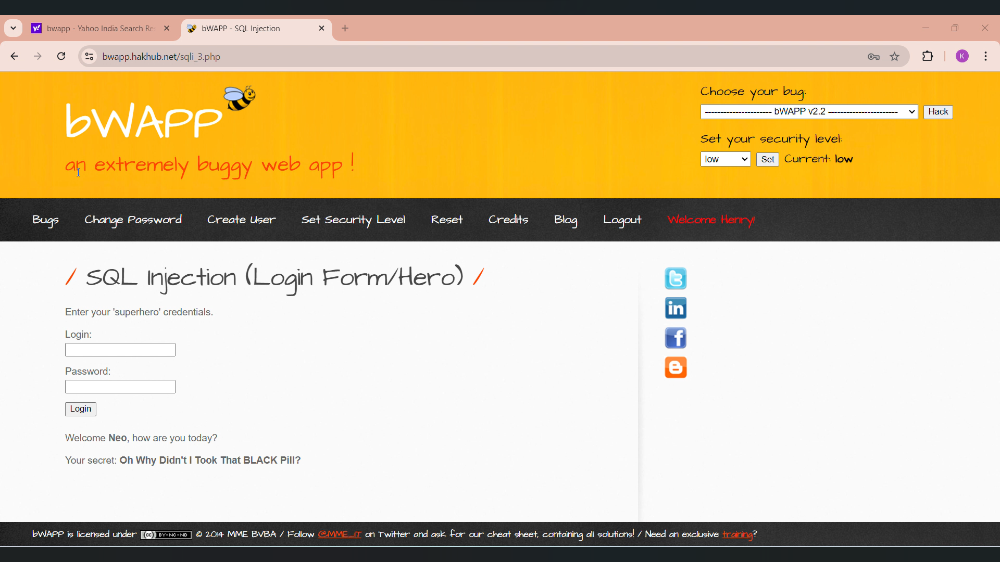
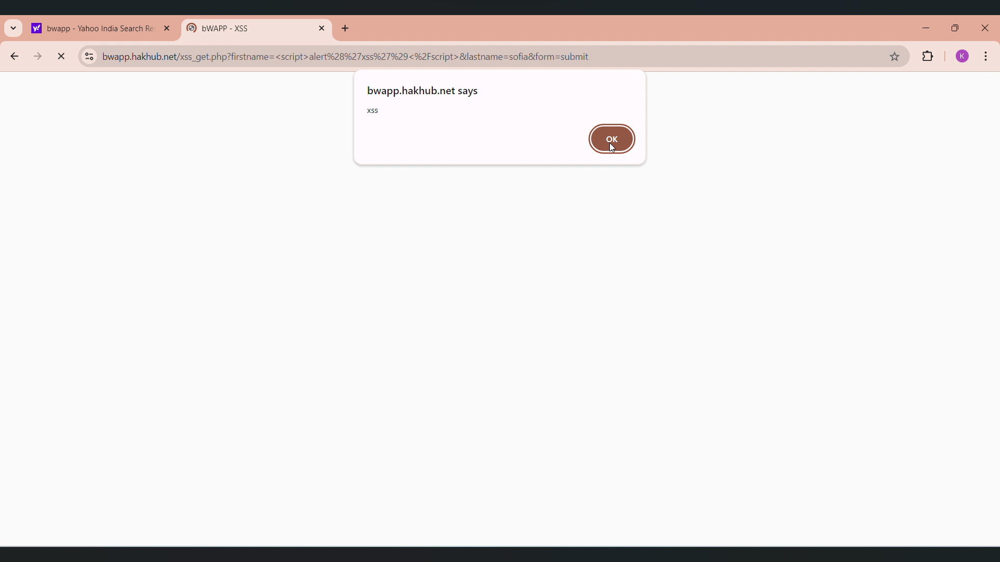
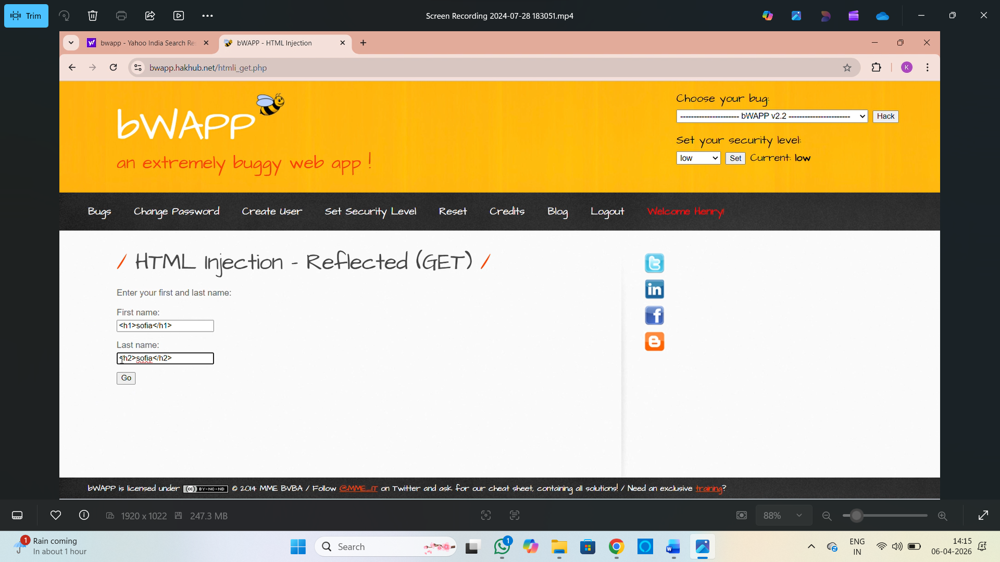
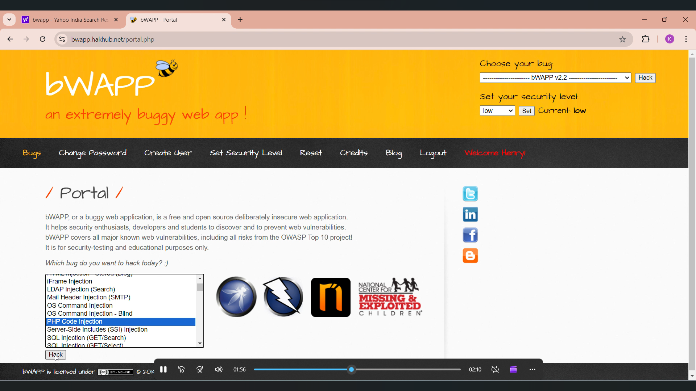

# 🔐 Security Testing using bWAPP

## 📌 Project Overview

This project demonstrates hands-on security testing using **bWAPP (Buggy Web Application)** to identify and exploit common web vulnerabilities. It focuses on understanding real-world attack techniques and improving application security.

---

## 🛠 Tools & Technologies

* bWAPP (Buggy Web Application)
* Burp Suite (for intercepting requests)
* Web Browser (Chrome)
* Kali Linux / Localhost Environment

---

## 🔍 Vulnerabilities Tested

### 1. SQL Injection

* Injected malicious SQL queries into input fields
* Bypassed authentication mechanisms
* Retrieved sensitive data from the database

### 2. Cross-Site Scripting (XSS)

* Injected JavaScript payloads into web inputs
* Executed scripts in the browser
* Demonstrated session hijacking risks

### 3. Command Injection

* Injected system-level commands into input fields
* Executed unauthorized commands on the server
* Demonstrated system compromise scenarios

---

## ⚙️ Testing Methodology

1. Set up bWAPP in a local environment.
2. Identified vulnerable input fields.
3. Intercepted HTTP requests using Burp Suite.
4. Injected malicious payloads.
5. Analyzed responses and confirmed vulnerabilities.

---

### 📸 Screenshots

### 🔹 SQL Injection Attack

### 🔹 SQL Injection Output

### 🔹 XSS Attack Output

### 🔹 HTML Injection

### 🔹 Command / PHP Injection

---

## 🎥 Demo Video

(Add your Google Drive / YouTube video link here)

---

## 📊 Findings

* Improper input validation
* Lack of output encoding
* Weak server-side security controls

---

## 🛡 Mitigation Techniques

* Use Prepared Statements / Parameterized Queries
* Implement Input Validation & Output Encoding
* Apply Security Headers (CSP, X-Content-Type-Options)
* Restrict system-level command execution
* Regular security testing and code reviews

---

## 🎯 Conclusion

This project provides practical exposure to web application vulnerabilities and demonstrates how attackers exploit insecure systems. It also highlights the importance of secure coding practices and proactive security testing.

---

## 👩‍💻 Author

**Kity (Kurma Roshitha)**
Cybersecurity Enthusiast 
